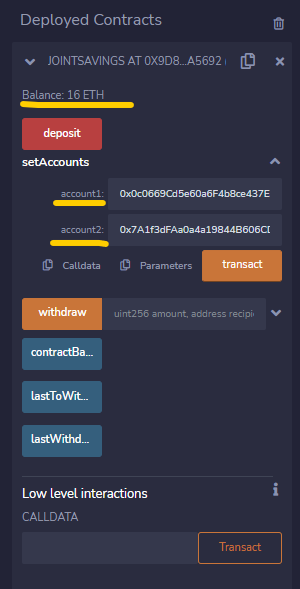
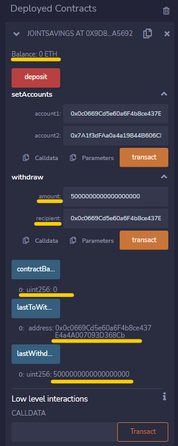

# Soldity Smart Contract Execution Results

  

## Table of Contents
  1. [Deploying Compiled Solidity Smart Contract](#deploying-compiled-solidity-smart-contract)
  2. [Depositing Ether for Testing Contract Functions](#depositing-16-ether-for-testing-contract-functions)
  3. [Transaction 1 -- Withdraw 1 Ether as Wei](#transaction-1----withdraw-1-ether-as-wei)
  4. [Transaction 2 -- Withdraw 10 Ether as Wei](#transaction-2----withdraw-10-ether-as-wei)
  5. [Transaction 3 -- Withdraw 5 Ether as Wei](#transaction-3----withdraw-5-ether-as-wei)
  6. [Conclusion](#conclusion)

## Deploying Compiled Solidity Smart Contract

* To deploy the solidity smart contract [ [joint_savings.sol](./joint_savings.sol) ] , hit the deploy button after successfully compiling the contract using Remix IDE.

---

## Depositing 16 Ether for Testing Contract Functions

* Here the deposit function was initially used to deposit 16 Ether for testing. The addresses of Account 1 & 2 were also appointed using the setAccounts function.

---

## Transaction 1 -- Withdraw 1 Ether as Wei

* Here the withdraw function was used to withdraw 1000000000000000000 Wei, which is equivalent to 1 Ether, to Account 1.
* The withdraw function has three outputs:
  * contractBalance
  * lastToWithdraw
  * lastWithrawAmount
* Outputs can be seen by clicking on each of the options. The smart contract balance decreased from 16 Ether to 15 Ether.

---

## Transaction 2 -- Withdraw 10 Ether as Wei

* Here the withdraw function was used to withdraw 10000000000000000000 Wei, which is equivalent to 10 Ether, to Account 2.
* The withdraw function has three outputs:
  * contractBalance
  * lastToWithdraw
  * lastWithrawAmount
* Outputs can be seen by clicking on each of the options. The smart contract balance decreased from 15 Ether to 5 Ether.

---

## Transaction 3 -- Withdraw 5 Ether as Wei

* Here the withdraw function was used to withdraw 5000000000000000000 Wei, which is equivalent to 10 Ether, to Account 2.
* The withdraw function has three outputs:
  * contractBalance
  * lastToWithdraw
  * lastWithrawAmount
* Outputs can be seen by clicking on each of the options. The smart contract balance decreased from 5 Ether to 0 Ether.

## Conclusion

---
